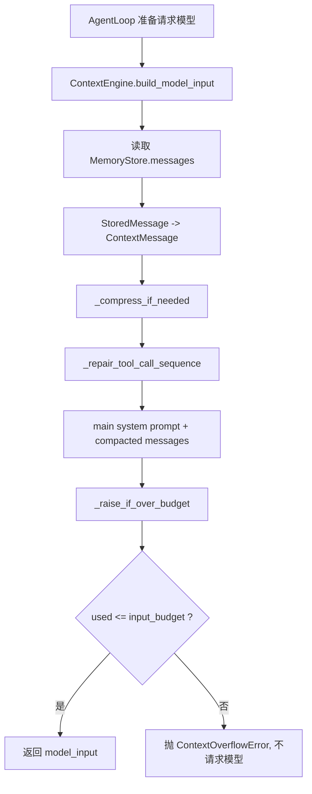
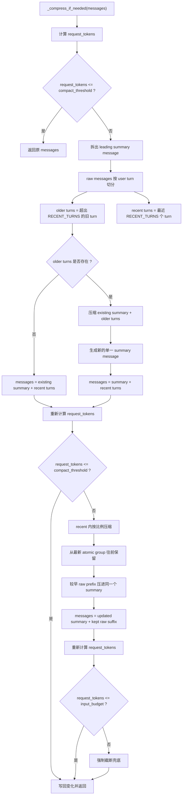
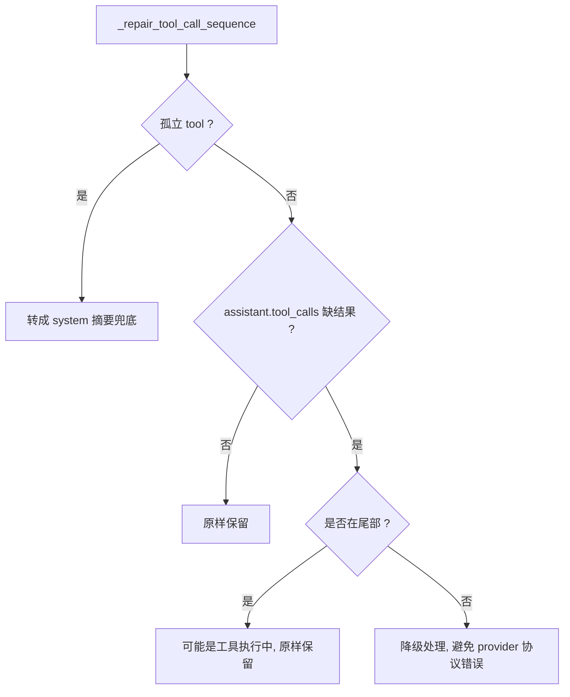
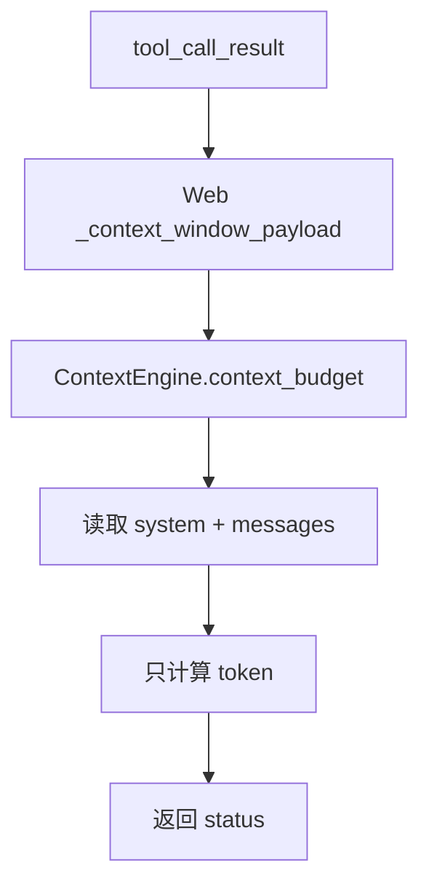

# 上下文压缩流程图

本文档描述当前 `ContextEngine` 的上下文压缩流程。最终策略是：

1. 先按 user turn 压缩旧历史。
2. 如果仍超过阈值，再把 recent messages 中较早的一段按比例压进同一个摘要。
3. 如果仍超过输入预算，最后强制截断。

整个对话列表最多只有一个压缩摘要。摘要直接作为一条 `system` message 存在 `messages` 最前面，不再使用 `conversation.summary`，也不再把摘要拼进主 system prompt。

## 关键概念

- `summary message`：唯一的压缩摘要消息，role 为 `system`，内容以前缀 `以下是已压缩的较早对话摘要` 开始。
- `raw messages`：除 summary message 之外的真实 user / assistant / tool 消息。
- `user turn`：从一条 `user` 消息开始，到下一条 `user` 消息之前的消息。
- `atomic group`：强制截断和比例压缩时的最小单位。普通消息是单独 group；`assistant.tool_calls` 和对应 `tool` 结果是一组。
- `compact_threshold`：提前压缩阈值。
- `input_budget`：真正发送模型前允许使用的输入 token 上限。

## 总入口



## 压缩总流程



## 阶段 1：按 Turn 压缩旧历史

目标：把超出最近 `RECENT_TURNS` 的旧 turn 统一压进唯一摘要。

```text
原始 messages:
| old turn 1 | old turn 2 | recent turn 1 | recent turn 2 |

压缩范围:
|========= compress =========|=========== keep ===========|
| old turn 1 | old turn 2 | recent turn 1 | recent turn 2 |

压缩后:
| summary | recent turn 1 | recent turn 2 |
```

如果已经存在 summary：

```text
原始 messages:
| summary | old turn | recent turn |

压缩输入:
| summary | old turn |

压缩后:
| updated summary | recent turn |
```

这里不会产生第二条摘要。旧摘要和新压缩内容会合并成一条新的 summary message。

## 阶段 2：Recent 内按比例压缩

如果阶段 1 后仍超过 `compact_threshold`，就继续压缩 recent messages 中较早的一段。

```text
当前 messages:
| summary | older recent raw | middle recent raw | latest raw |

按 RAW_KEEP_RATIO 保留最新原文:
| summary |========= compress =========|====== keep raw ======|
| summary | older recent | middle recent | latest raw |

压缩后:
| updated summary | latest raw |
```

实际选择范围时按 atomic group 操作：

```text
raw groups:
| U1 | A1 | tool group 1 | U2 | A2 | tool group 2 | U3 | A3 |

从后往前保留，直到达到 raw_keep_budget:
|=========== compress prefix ===========|======= keep suffix =======|
| U1 | A1 | tool group 1 | U2 | A2 | tool group 2 | U3 | A3 |

压缩后:
| updated summary | tool group 2 | U3 | A3 |
```

注意：

- 压缩的是连续 prefix，不选择离散工具组。
- `assistant.tool_calls` 和对应 `tool` 结果不会被拆开。
- 压缩结果仍然写回唯一 summary message。

## 阶段 3：强制截断

如果摘要后仍超过 `input_budget`，才进入强制截断。

```text
当前 messages:
| summary | raw 1 | raw 2 | raw 3 | latest raw |

从后往前保留:
| drop maybe | drop maybe | keep latest atomic groups |

结果:
| latest raw |
```

如果 summary 放得下，可以保留：

```text
| summary | latest raw |
```

如果空间极端不足，summary 也可以被丢弃，优先保留最新可发送的原子组。

## Repair 兜底

压缩和截断都应该保持 tool-call 结构完整。`_repair_tool_call_sequence()` 只处理异常历史：



正常新对话不应该依赖 repair 修复结构。如果 repair 经常触发，说明写入、压缩或截断阶段破坏了 atomic group。

## 实时状态刷新

状态栏预算刷新必须是纯读路径：



状态刷新不能调用 `build_model_input()`，因为后者可能压缩、repair 并写库。

## 最终模型输入结构

无摘要：

```text
system: main system prompt
user: 最近用户消息
assistant: 最近助手消息
```

有摘要：

```text
system: main system prompt
system: 以下是已压缩的较早对话摘要...
user: 最近用户消息
assistant: 最近助手消息
tool: 最近工具结果
```

## 日志顺序参考

```text
context_compact_check
context_compact_split
context_turns_compress_start / context_turns_compress_done   # 可选
context_ratio_compress_start / context_ratio_compress_done   # 可选
context_force_truncate_start / context_force_truncate_done   # 最后兜底, 可选
context_compact_persist                                      # 有变化才写库
context_budget_final
```

健康判断：

- 正常情况下，一个对话最多只有一个 leading summary message。
- 摘要应出现在 messages 最前面，而不是 main system prompt 内。
- `context_force_truncate_*` 只应在摘要仍无法进入输入预算时出现。
- 状态刷新期间不应出现压缩或写库日志。

## 配置

```text
RECENT_TURNS = 6
RAW_KEEP_RATIO = 0.6
COMPACT_THRESHOLD_RATIO = 0.8
```

- `RECENT_TURNS`：第一阶段保留最近多少个 user turn。
- `RAW_KEEP_RATIO`：第二阶段 recent 内最多保留多少输入预算比例的原文。
- `COMPACT_THRESHOLD_RATIO`：达到输入预算多少比例时开始提前压缩。

